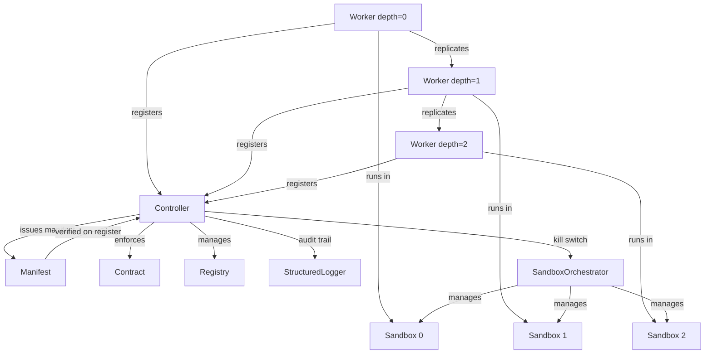

# Architecture

The AI Replication Sandbox follows a **hub-and-spoke model** where the Controller is the central authority and Workers are the executing agents.

## System Diagram



## Component Overview

### Controller

The **Controller** is the central authority. It:

- Issues and cryptographically signs worker manifests
- Maintains a registry of all active workers
- Enforces contract constraints (depth, quotas, cooldowns, stop conditions)
- Provides a **kill switch** for emergency termination
- Reaps stale workers that miss heartbeat deadlines
- Maintains a complete audit trail

### ReplicationContract

The **Contract** defines the replication policy:

| Parameter | Purpose |
|-----------|---------|
| `max_depth` | Maximum generations of replication |
| `max_replicas` | Maximum concurrent active workers |
| `cooldown_seconds` | Minimum time between spawns from same parent |
| `expiration_seconds` | Auto-shutdown timer for workers |
| `stop_conditions` | Custom predicates to block replication |

### Manifest

Each worker carries an immutable **Manifest** containing:

- Unique worker ID and parent lineage
- Replication depth
- Cloned state snapshot
- Resource quotas (CPU, RAM, network policy)
- Issuance timestamp
- HMAC-SHA256 signature

### Worker

**Workers** are the executing agents. They:

- Register with the Controller on creation
- Execute tasks (with expiration and kill switch checks)
- Heartbeat back to the Controller
- Optionally self-replicate (subject to contract)
- Shut down gracefully

### SandboxOrchestrator

The **Orchestrator** simulates isolated container environments:

- CPU and RAM limits per worker
- Network policy (egress restricted to controller only)
- Lifecycle management (launch, kill, kill-all)
- Resource enforcement metrics

### StructuredLogger

The **Logger** provides structured observability:

- Lifecycle events (start, heartbeat, shutdown)
- Replication decisions (approved, denied, with reasons)
- Audit trail for security-sensitive actions
- Resource enforcement metrics

## Replication Flow

1. **Controller** issues a signed `Manifest` for the root worker
2. **Worker** registers with the Controller (manifest signature is verified)
3. **Worker** executes tasks, sending heartbeats back to the Controller
4. **Worker** requests replication → Controller checks contract (depth, quota, cooldown, stop conditions)
5. If allowed, Controller issues a child manifest → new Worker spawns in its own sandbox
6. **Kill switch** can terminate all workers at any time

## Data Flow

```
Worker.perform_task(fn)
  → Check expiration
  → Check kill switch
  → Execute task
  → Send heartbeat to Controller
  → Orchestrator enforces resource bounds

Worker.maybe_replicate(reason, state)
  → Controller.can_spawn(parent_id)
    → Check kill switch
    → Check quota (max_replicas)
    → Check cooldown
    → Check depth (max_depth)
  → Controller.issue_manifest(...)
    → ManifestSigner.sign(manifest)
  → New Worker(manifest, ...)
    → Controller.register_worker(manifest)
      → ManifestSigner.verify(manifest)
      → Contract.evaluate(context)  # stop conditions
    → Orchestrator.launch_worker(manifest)
```
